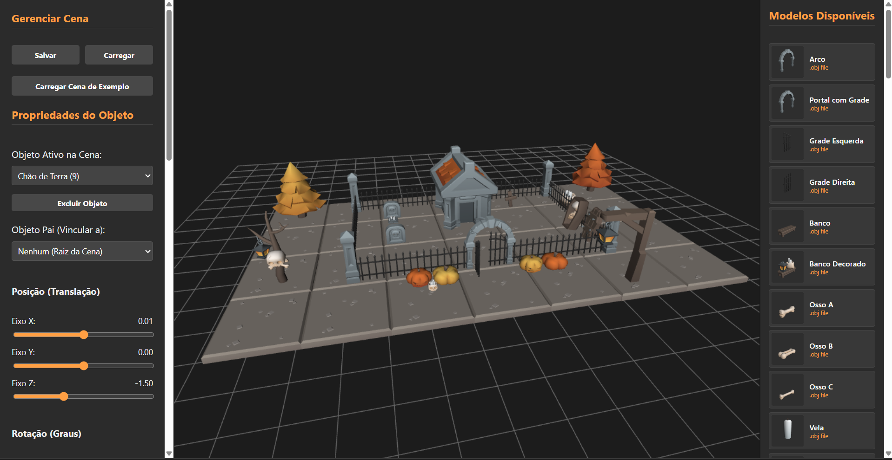

# Editor de Cena 3D - WebGL2

Editor de cenários tridimensionais interativo, desenvolvido em **WebGL2 nativo** com interface voltada para Desktop. Permite posicionar, transformar e organizar hierarquicamente modelos 3D de uma temática de Halloween, com exportação/importação de cenas em JSON.

A aplicação utiliza as bibliotecas auxiliares **`TWGL.js`** (simplificação da API do WebGL, gerenciamento de buffers, atributos e uniformes) e **`m4.js`** (operações de álgebra linear e matrizes de transformação 4x4).

🔗 **Demo online:** [https://fabriciobartz.github.io/editorDeCena](https://fabriciobartz.github.io/editorDeCena/)

---

### Tela Inicial 
Abaixo, a demonstração da tela inicial do editor de cenários.

  

---

## Índice

- [Funcionalidades](#funcionalidades)
- [Controles e Uso](#controles-e-uso)
- [Princípios Gráficos e Arquitetura](#princípios-gráficos-e-arquitetura)
- [Estrutura de Arquivos Principais](#estrutura-de-arquivos-principais)
- [Como Rodar o Programa](#como-rodar-o-programa)
- [Créditos](#créditos)

---

## Funcionalidades

- **Catálogo de modelos 3D** (temática de Halloween: abóboras, lápides, tochas, ossos, cercas, etc.), exibido com miniaturas geradas dinamicamente em 3D.
- **Adição e remoção** de objetos na cena.
- **Transformações completas** por objeto: posição, rotação (X/Y/Z) e escala independente por eixo.
- **Hierarquia entre objetos** — vínculo pai-filho, onde um objeto herda posição/rotação/escala do seu "pai" na cena.
- **Seleção por clique** direto no canvas (via *color picking*, sem raycasting).
- **Animação de vaivém** configurável por objeto, com interpolação suave (LERP + easing senoidal).
- **Mapeamento de textura por atlas**, com controle de offset/repeat em tempo real.
- **Desfazer (Ctrl+Z)** com histórico de estados da cena.
- **Salvar cena** como arquivo `.json` para o computador.
- **Carregar cena** a partir de um arquivo `.json` local.
- **Carregar cena de exemplo** direto do repositório, com um clique — útil para quem está testando a demo pela primeira vez e não tem um arquivo de cena próprio.

## Controles e Uso

| Ação | Como fazer |
|---|---|
| Selecionar um objeto | Clique nele diretamente no canvas 3D |
| Adicionar objeto à cena | Escolha um modelo no catálogo lateral e clique para adicionar |
| Transformar objeto selecionado | Use os sliders/inputs de posição, rotação e escala no painel lateral |
| Definir hierarquia (pai/filho) | Selecione o objeto "filho" e escolha o "pai" no dropdown correspondente |
| Desfazer última ação | `Ctrl + Z` |
| Salvar cena atual | Botão **"Salvar"** — baixa um `.json` com o estado da cena |
| Carregar cena própria | Botão **"Carregar"** — abre o seletor de arquivos do seu computador |
| Ver uma cena pronta rapidamente | Botão **"Carregar Cena de Exemplo"** — carrega instantaneamente a cena de exemplo incluída no repositório, sem precisar de nenhum arquivo local |

> **Nota técnica:** o botão "Carregar" usa um `<input type="file">`, que por segurança do navegador só acessa arquivos do computador de quem está usando o site — nunca arquivos do servidor. Por isso o botão "Carregar Cena de Exemplo" existe separadamente: ele busca (`fetch`) o arquivo `cena/minha_cena_halloween.json` diretamente do repositório, funcionando para qualquer visitante, mesmo sem nenhum arquivo salvo localmente.

---

## Princípios Gráficos e Arquitetura

O ecossistema foi construído sobre conceitos consolidados de computação gráfica de alto desempenho e otimização de recursos de hardware:

* **Piso de Grade (`gl.LINES`):** O chão estruturado do cenário é gerado dinamicamente no arquivo `geometry-utils.js`. O sistema calcula os vértices espaciais no plano $Y = 0$ e utiliza a primitiva gráfica `gl.LINES` para conectar os pontos através da GPU, fornecendo uma referência métrica estável de $20 \times 20$ unidades para o usuário.
* **Transformações Afins (Matrizes Homogêneas $4 \times 4$):** Cada monstro instanciado sofre transformações geométricas computadas de forma sequencial (Translação $\rightarrow$ Rotação X $\rightarrow$ Rotação Y $\rightarrow$ Rotação Z $\rightarrow$ Escala). O pipeline converte esses dados em matrizes homogêneas de dimensão 4 para enviar os dados unificados de posicionamento diretamente aos Shaders.
* **Grafo de Cenas e Vínculos Hierárquicos:** O motor implementa uma árvore de herança física baseada em matrizes globais. Através de um laço estruturado, o loop principal computa de forma iterativa as multiplicações matriciais necessárias para que os objetos "filhos" herdem e acompanhem organicamente a posição, escala e rotação de seus respectivos objetos "pais".
* **Instanciamento Inteligente e Reutilização de Memória:** O motor gráfico utiliza um sistema de cache dinâmico para garantir alta taxa de quadros (FPS). Quando um modelo é adicionado à cena, o sistema verifica se sua geometria já existe no mapa `modelosCarregados`. Caso exista, os buffers e o Vertex Array Object (VAO) na GPU são totalmente reaproveitados. Isso cria um loop eficiente que evita duplicar malhas idênticas na memória de vídeo, gerando apenas instâncias leves com dados individuais de transformação.
* **Seleção por Mouse (*Color Picking*):** Para evitar cálculos geométricos pesados de colisão por raios (*raycasting*), a seleção de objetos ocorre via hardware. Ao clicar no canvas, a cena é desenhada em um buffer oculto com o parâmetro `u_drawPicking` ativo, onde cada monstro recebe uma cor sólida única (ID Cromático). A função nativa `gl.readPixels` lê a cor exata sob o cursor e identifica instantaneamente a instância selecionada.
* **Estúdio Fotográfico Oculto (*Offscreen Rendering*):** As miniaturas em 3D exibidas no catálogo lateral direito não pesam na renderização principal. O arquivo `thumb-generator.js` inicializa um contexto WebGL2 em um canvas isolado de $128 \times 128$ pixels na memória RAM, renderiza os objetos em ângulo isométrico fixo uma única vez durante o carregamento da página e exporta os pixels como uma string de imagem PNG (*Data URL* Base64) aplicada diretamente nas tags `` do HTML.
* **Mapeamento de Textura via Atlas (Coordenadas UV):** A aplicação otimiza o uso de memória carregando um único arquivo `atlas.png`. Os inputs numéricos de deslocamento (*Offset*) e repetição (*Repeat*) manipulam diretamente uma matriz de textura 2D (`textureMatrix`) nos Shaders, deslocando as coordenadas UV para remapear o envelopamento de imagem da malha em tempo real.
* **Animação por LERP com Easing Senoidal:** O movimento de vaivém configurável utiliza a técnica de **Interpolação Linear (LERP)** balizada pelo relógio interno do navegador. O tempo do sistema alimenta uma função `Math.sin`, gerando um fator elástico normalizado estritamente entre `0.0` (Origem) e `1.0` (Destino), garantindo uma aceleração e desaceleração biológica e fluida nas extremidades da trajetória.
* **Histórico de Estados (Pilha / Padrão Memento):** O sistema de "Desfazer" (Ctrl + Z) opera sob uma estrutura de dados de **Pilha (Stack)** regida pela lógica LIFO (*Last In, First Out*). Toda vez que um objeto sofre mutação, a lista de instâncias é serializada em texto estável via `JSON.stringify` e guardada na pilha, permitindo o resgate idêntico do cenário passado ao desempilhar com `.pop()`.

---

## Estrutura de Arquivos Principais

* **`app.js`**: O núcleo e cérebro da aplicação. Gerencia o contexto gráfico, o loop contínuo de renderização a 60 FPS (`requestAnimationFrame`), escuta eventos de periféricos (mouse/teclado), controla o Grafo de Cena e centraliza os arrays de estados.
* **`shaders.js`**: Define os códigos em linguagem **GLSL ES 3.0** executados diretamente nos núcleos da GPU. O *Vertex Shader* cuida das transformações de coordenadas e o *Fragment Shader* computa a iluminação difusa Lambertiana, amostragem de texturas e renderizações sólidas de picking.
* **`ui-manager.js`**: Gerencia o acoplamento de mão dupla entre a interface e o motor. Garante que os sliders HTML atualizem as variáveis em tempo real e vice-versa sem gerar concorrência na memória ativa.
* **`thumb-generator.js`**: Dita as regras do pipeline isolado para a fotografia tridimensional em segundo plano das miniaturas.
* **`obj-parser.js`**: Interpretador responsável por ler arquivos de texto puros no formato Wavefront `.obj` e estruturar vetores numéricos de posições, normais e UVs prontos para os buffers do WebGL2.
* **`geometry-utils.js`**: Utilitário matemático focado na modelagem algorítmica do grid do solo.
* **`cena/`**: Contém a cena de exemplo (`minha_cena_halloween.json`), carregável diretamente pela interface.
* **`models/`**: Modelos `.obj`, atlas de textura e catálogo de modelos disponíveis (`models/json/models.json`).

---

## Como Rodar o Programa

### Localmente

1. Certifique-se de ter o editor **VS Code** instalado.
2. Instale a extensão **Live Server** (desenvolvida por Ritwick Dey) através do menu de Extensões (`Ctrl+Shift+X`).
3. Abra a pasta do projeto completo no VS Code.
4. No canto inferior direito da barra de status do VS Code, clique no botão **"Go Live"** (ou clique com o botão direito sobre o arquivo `index.html` e escolha *Open with Live Server*).
5. O seu navegador padrão abrirá automaticamente o link `http://127.0.0.1:5500/index.html` com o projeto rodando perfeitamente.

### Publicado (GitHub Pages)

O projeto é 100% estático (HTML/CSS/JS puro, sem backend), então também está disponível publicado via GitHub Pages — veja o link no topo deste README.

---

## Créditos

- Modelos 3D de temática Halloween: pack **KayKit Halloween Bits**, de [Kay Lousberg](https://kaylousberg.com/) *(confira a licença específica do pack antes de redistribuir)*.
- Bibliotecas: [TWGL.js](https://twgljs.org/) e [m4.js](https://webgl2fundamentals.org/) (parte do ecossistema de tutoriais WebGL2Fundamentals).

---

Projeto desenvolvido para fins de aprendizado.
